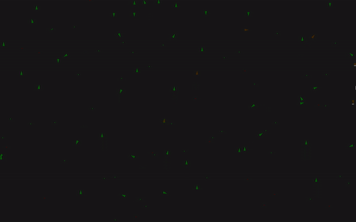

# Evolution Simulator

##[LIVE DEMO!](https://evolutionsimulator.herokuapp.com/)
Look! I made an evolution Simulator!   

## How it works
   - Creatures move around the map eating green dots to stay alive and avoiding red dots
   - Creatures are randomly generated to have different perception radii and attraction to poison and food
   - Some creatures just end up attracted to poison or can't see more than 5 px in front of them. It sucks but thats life :/
   - Creatures will die off if they eat too much poison or can't get food quick enough
   - Thriving creatures reproduce asexually and pass on their genetics to offspring with a 1% mutation rate

   TLDR: WOOOO!!! Genetic algorithm that creates an optimized creature for survival in a specific enviroment.

  *P.S I added a dom checkbox at the bottom (if you scroll) that allows you to see the characteristics of each creature*   

## Built using:
  - JavaScript
  - P5.js
